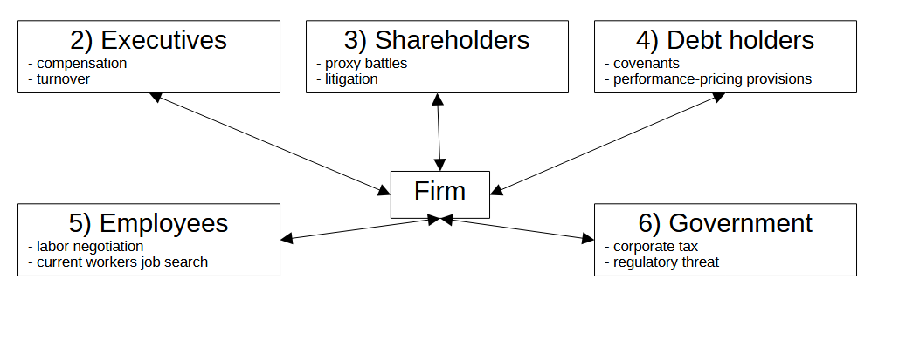
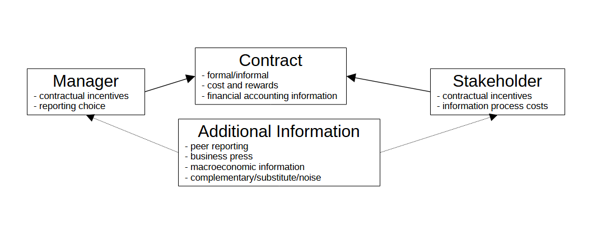
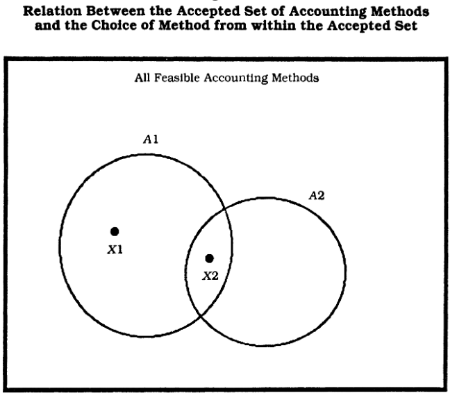
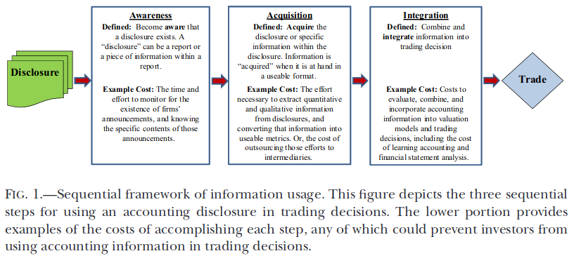

# Accounting in Corporate Governance: A Contractual View

   

### Marcelo Ortiz

Universitat Pompeu Fabra

Barcelona School of Economics

UPF-BSM

---
# Summary

Based on a contractual view of the firm, during this class we will review the literature respond one key question:

**How financial accounting information is used to detect and aliviate governance conflicts?**

---
We will not cover:
- financial accounting & capital markets.
- financial accounting regulation.
- managerial accounting. 

---

# 1) Introduction
## Theory of the firm

We start by understanding a corporation  as a nexus of contracts designed to minimize contracting costs (Coase, 1937).

Those contracts govern how costs and rewards are allocated among stakeholders (Jensen & Meckling, 1977).

The literature has branched into various sub-disciplines to accommodate the diverse interests and contractual obligations of different corporate stakeholders in relation to rewards and costs (Bechuk & Weisbach, 2010).

---
## Financial Accounting Information in Contracts
**What is the role of financial accounting information in these contracts?**

Ex ante: Contracting parties require information to establish the terms of the contract.

Ex post: Contracting parties need information about the firm’s ability to satisfy the terms of contracts.

**What information?** 

Ideally, economic profits: drivers, type, and distribution across stakeholders.

**Accounting profits act as surrogates for economic profits** as long as less costly alternative sources do not provide similar or better information on rents.

Implicit and explicit Contracts use accounting numbers (Watts & Zimmerman 1986).

---
## Definition of  Financial Accounting information
Bushman & Smith (2003) define it as:
> Financial accounting information is the product of corporate accounting and external reporting systems that measure and routinely disclose audited, quantitative data concerning the financial position and performance of publicly held firms. Audited balance sheets, income statements, and cash-flow statements, along with supporting disclosures, form the foundation of the firm-specific information set available to investors and regulators. 

---
## Characteristics of Financial Accounting Information
The characteristics are detailed in conceptual framework of financial reporting issued by standard-setting bodies such as the Financial Accounting Standards Board (FASB) in the United States and the International Accounting Standards Board (IASB). 
 
The primary qualitative characteristics are: value-relevance, faithful representation, comparability, and verifiability.
<!--
---

## Toward a foundation of financial accounting information in corporate governance

Scholars have develop or employed variaty of theories to explain specific facets of the role of financial accounting information in corporate governance.

- Reporting choice: Accounting choice (Watts & Zimmerman 1978), Disclosure choice (Verrecchia 1983; Dye 1985; Diamon 1985). 

- Executives: Agency theory and optimal compensation contracts (Jensen & Meckling 1976; Holmstrom & Milgrom 1991).

- Debt holders: Adverse selection and the agency costs of debt (Myers & Majluf 1984; Diamond 1991; Leftwich 1983).

- Employees: has been bargaining theory, 

- Shareholders theory of market information innefficiencies.
-->
<!--The diversity of theories has helped us to develop a rich understanding of the specific features they focus on. However, this diversity also comes with a cost: we lack a foundational theory explaining the big picture, that explaining accounting and disclosing choices for informing/biasing any stakeholders. Besides the theoretical value, there are two practical benefit of investing in a foundational theoretical framework: facilitating the absorption of studies for people in other research lines, and teaching introductory PhD courses on financial accounting research.-->

---
The Basic Theoretical Framework 

here the middle box should say: contract (- explicit/implicit -costs and rewards, -financial accounting information ) 

---
# The Manager and the Reporting Choice
<!--maybe a I should defined it broadly as reporting choice and using that keyword? check literature on the topic -->
Fields et al. (2001):
> An accounting choice is any decision whose primary purpose is to influence (either in form or substance) the output of the accounting system in a particular way, including not only financial statements published in accordance with GAAP, but also tax returns and regulatory filings.

These choices are made _within_ the legal framework: IFRS, US GAAP, etc.

The types of accounting choices and their classifications can be broadly categorized into several  groups: Accounting Policies, Accounting Estimates, Disclosing Policy, and Real Decisions.

---

1.  Accounting Policies: These are the specific principles, bases, conventions, rules, and practices applied by an entity in preparing and presenting financial statements. 

    - Revenue recognition methods (e.g., point of sale, percentage of completion)
    - Inventory valuation methods (e.g., FIFO, LIFO, weighted average)
    - Depreciation methods (e.g., straight-line, declining balance)
    - Capitalization versus expensing of certain costs

2.  Accounting Estimates: These involve judgment in the preparation of financial statements, where it is difficult to measure the exact amount with certainty.

    - Allowance for doubtful accounts.
    - Useful lives and residual values of depreciable assets.
    - Provisions for warranties or litigation.
    - Fair value estimates for financial or non-financial assets.

---
3. Disclosing Policy: These are the choices made by management in determining the extent and nature of disclosures in the financial statements and related notes.

    - Level of transparency: (e.g., segment reporting, related party transactions).
    - Timing of disclosing: (e.g., timing of going concern, new standard adoption).

4. Real Decisions: These are made primarily for the purpose of affecting the accounting numbers in this definition.
    - Increasing production to reduce cost of goods sold by reducing per unit fixed costs.
    - Reducing R&D expenditures to increase earnings.
---

Source: Watts & Zimmerman (1990)

<!-- maybe work further here on my idea that some sets can be considered "conservatism" and others "fair value accounting" and so on... -->

---
Watts and Zimmerman (1990):
> The set of accounting procedures within which managers have discretion is called the "accepted set." It is voluntarily determined by the contracting parties. Managerial discretion over accounting method choice (i.e., the "accepted set" ) is predicted to vary across firms with the variation in the costs and benefits of restrictions. 

> These restrictions produce the "best" or "accepted" accounting principles even without mandated accounting standards by government. The restrictions are enforced by external auditors. 

> Reacting to the incentive of managers to exercise accounting discretion opportunistically, the accepted set includes "conservative" (e.g., lower of cost or market) and "objective" (e.g., verifiable) accounting procedures .

---
Once the manager decided a set of accounting choices, the output (financial statements) is available to the stakeholders.

Importantly, other stakeholders face serious challenges for undoing the manager's accounting choices.
- even though reporting regulation may require disclosing accounting choices and their changes, other stakeholders do not have the same information as the manager for re-computing the financial statements assuming alternative choices.

---
# The Stakeholder and the Cost of using the Financial Accounting Information

Source: Blankespoor et al. (2019)
<!--awareness: Grossman and Stiglitz [1980], Merton [1987] -->

---
# Additional information channels

- peer reporting.
- macroeconomic indicators.
- business press.
- private information.
- social media.

---
# 2) Stakeholder: Employees
## (a) Accounting and Labor Negotiation
- The fraction of economic rents that are distributed to labor is defined initialy in the respective contract. However, some firms have regular renegotiation: collective agreements or labor union contract negotitation (Liberty & Zimmerman, 1986).

**Accounting information:**
- Most of the labor regulations request to the employeer to furnish accounting data relevant for the negociation: "bargain in good faith" (Cooper & Essex, 1977).

- Sensitive sales or production information is allowed to dont be shared if affect the competitive position of the firm.

- The objective is to establish the "ability to pay" of the company (Goggans, 1964).

---
- Liberty & Zimmerman (1986): US unionized companies over the period 1968-1981. We find no evidence of lower than expected earnings during negotiations

- Osma et al (2015): US firms that engage in firm-level labor bargaining during the period 1994-2007, we provide evidence consistent with the hypothesis that managers and employees are more likely to sign an agreement when firm profitability and liquidity is low. In a second set of analyses we study whether the coincidence of low corporate income and collective agreement negotiations is driven by accounting choice. The results provide evidence in favor of the hypothesis that managers accelerate the recognition of losses and delay the recognition of gains in years surrounding collective bargaining. However, the evidence suggests this choice is informative rather than opportunistic. We do not find conclusive evidence of accounting accruals manipulation, consistent with the results found by prior research.

---
## (b) Accounting and Employee Job Search
- rank-and-file employees (deHAAN et al., 2023)
- EAs provide information about firms’ financial conditions, which can affect future job security, raises, promotions, fulfillment of implicit commitments, and resume value.

- Also, even though employees can directly observe some aspects of firm performance, their information is likely incomplete, lacks the credibility of public reports,

- even if employees do care about the average firm’s financial condition, they may have little to learn from public EAs if they can sufficiently observe firm operations as insiders. For example, studies find that rank-and-file employees have private information about accounting performance that is revealed in later EAs (Hales, Moon Jr, and Swenson [2018], Huang, Li, and Markov [2020], Li, Wong, and Zhou [2019]).
---
- We use weekly counts of Glassdoor reviews by current employees as a proxy for new job searchers, and use abnormal within-quarter changes in review counts to identify changes in search around EAs. Our sample includes reviews from current employees of public companies from June 2012 through August 2016

---
# 3) Stakeholder: Executives
## (a) Accounting  and  Executive Compensation

Managerial compensation typically consists of base salary and incentive compensation. 

Accounting measures, especially measures of profitability, are extensively used in executive compensation contracts (Murphy 1999; Ittner et al. 1997)
- Short-term bonus contracts are often tied to reported accounting performance measures such as net income, ROA and ROE.
- Longer-term incentive compensation is often tied to stock performance.
- Similar evidence, but far less extensive, about the use of accounting measures in divisional managers' compensations (Bushman et al. 1995, Keating 1997).
---

The compensation contracts allow managerial accounting discretion. Why?
- More informative signals about firm performance (Dye and Verrecchia (1995)).
- The discretion can increase share value, by for example, reducing the probability of bond covenant violations.

---
- Healy (1985), Guidry et al.(1999): upper and lower band. Managers choose current discretionary accruals to maximize both this period’s bonus and the expected value of next period’s bonus.
- Elliott &  Shaw (1988); Strong & Meyer (1987): 'big bath’ behavior. When earnings are already below expectations, some managers allegedly write-off (perhaps prematurely) as many costs as possible in that period with the intention of claiming they are ‘clearing the decks’ to facilitate improved future performance.

---
- Bushman, Engel, Milliron, and Smith (1998) document that over the 1971-95 period, firms have substituted away from accounting earnings toward equity-based plans.

That this means that accounting information has become less important for the governance of firms?
1. Reliabale accounting information is a precondition for a well-funcioning stock market and thus, the use of stock-based compensation.
2. Stock price is not a sufficient statistic for managerial performance (maybe, just for firm value, Grossman & Stiglitz 1980).
    - We observe analysts pouring over the details of financial statements, such as margin analyses, expense ratios, and geographic and product line segment data.
3. Stock proce is by definition forward-looking, based in market expectations and risk, therefore, very limited in its ability to evaluate managers' past performance.

---
## (b) Accounting  and Executive turnover
Compensation is not the only incentive for managers: threat of dismissal.

Several studies have found a negative relation between accounting performance and CEO turnover  (Weisbach (1988); Murphy & Zimmerman (1993), Lehn & Makhija (1997))

- Weisbach finds that accounting performance appears to be more important than stock price performance in explaining turnover. 
- Murphy and Zimmerman find a significant inverse relation between both performance measures and turnover.

<!-- TODO: MORE RECENT?-->

---
# 4) Stakeholder: Shareholder 
- Shareholders are the residual claimants of the firm, and they have the right to vote in the general assembly of shareholders.
- The general assembly of shareholders has the power to appoint and dismiss top management and to approve the financial reports.
- But if all shareholders are dispersed and diversified, they may not have the incentives to monitor the firm, even if the information is perfect and available at no cost.
- Admati, Pfleiderer, & Zechner (1994)
    - Ownership structure affects the payoffs of firms since it affects optimal monitoring efforts.

---
Mechannisms:
- Proxy battles 
- Proposal at shareholder meetings 
- Public campaigns
- Litigation 
- Negotiation with management

---

**(a) Accounting and Proxy contests:**
- DeAngelo’s (1988) study of the role of accounting information in proxy fights. She documents a heightened importance of accounting information during proxy fights by providing evidence of the prominent use of accounting numbers. She presents evidence that dissident stockholders typically cite poor earnings performance as evidence of incumbent managers’ inefficiency (and rarely cite stock price performance), and that incumbent managers use their accounting discretion to portray a more favorable impression of their performance to voting shareholders. DeAngelo suggests that accounting information may better reflect incumbent managerial performance during proxy fights because stock price anticipates potential benefits from removing underperforming incumbent managers.
<!-- TODO: MORE RECENT?-->

---
**(b) Accounting and Litigation:**
- Francis, Philbrick, and Schipper's 1994 study, "Shareholder Litigation and Corporate Disclosures," examines the relationship between shareholder lawsuits and the quality of corporate financial disclosures. They find that firms subject to litigation tend to improve the transparency and quality of their financial reporting.

- Douglas J. Skinner's 1994 paper, "Why Firms Voluntarily Disclose Bad News," explores the strategic disclosure of financial information in the context of shareholder litigation. Skinner suggests that firms may voluntarily disclose adverse information to manage litigation risk, highlighting an interaction between corporate disclosure practices and governance through litigation.
<!-- TODO: WHAT INFORMATION IS USED IN LITIGATIONS? WHAT THE LITIGATION ARE ABOUT-->

---

# 4) Stakeholder: Creditors

Creditor rights in corporate governance encompass the legal and contractual protections and mechanisms that safeguard the interests of lenders and bondholders. These rights are fundamental to the governance framework of corporations, as they directly influence corporate financing decisions, risk management practices, and the overall alignment between the company's actions and its obligations to creditors.

The protections for creditors are typically enshrined in law (such as bankruptcy laws) and detailed within the contractual agreements of debt instruments (like covenants in loan agreements).

---
As in the previous case, information frictions and control rights give rise to agency problems between shareholders (manager) and creditors. (La Porta et al., 1997).
 - dividends payments
 - debt overhang
 - asset substitution
 - refinancing and restructuring
 - bankruptcy and liquidation preferences
--- 
## (a) Accounting and Covenants
<!-- add some stats of debt-covenants types and metrics used -->

Managers may select or change accounting methods to avoid debt covenant violations.

This has been tested among firms that are close or have reached to debt covenants (Healy & Palepu, 1990; Sweeney, 1994; DeAngelo et al. 1994).

Findings suggest that firms make accounting decisions in response to potential covenant violations only when there is no lower cost solution.

Additionally, firms breaching coventants may be renegotiating many of their contracts simultaneusly, so it is difficult to associate any evidence of accounting choice with any one contractual concern.

---

<!-- TODO: ADD PAPERS OF THE LBS STUFF AND CORREA>
<-- (e.g., Smith and Warner, 1979)-->

# 5) Stakeholder: Government

## (a) Accounting and Taxation

paper on JAR sobre IRS monitoring and disclosing

## (b) Accounting and Other Regulations
---
# 6) Evidence of Peer reporting as external governance mechanism
# Labor Negotiations
ver el paper en JAE on reporting when your peers are unionized

# CEO compensation:
DeFond and Park (1999) and Parrino (1997), examining CEO turnover probabilities, posit that in more competitive industries, peer group comparisons are more readily available, creating opportunities for more precise performance comparisons.

Ortiz et al (2021).

# Shareholder rights and activism
- Ortiz et al (2023): peer reporting foster the acquistion of low-performing firms.